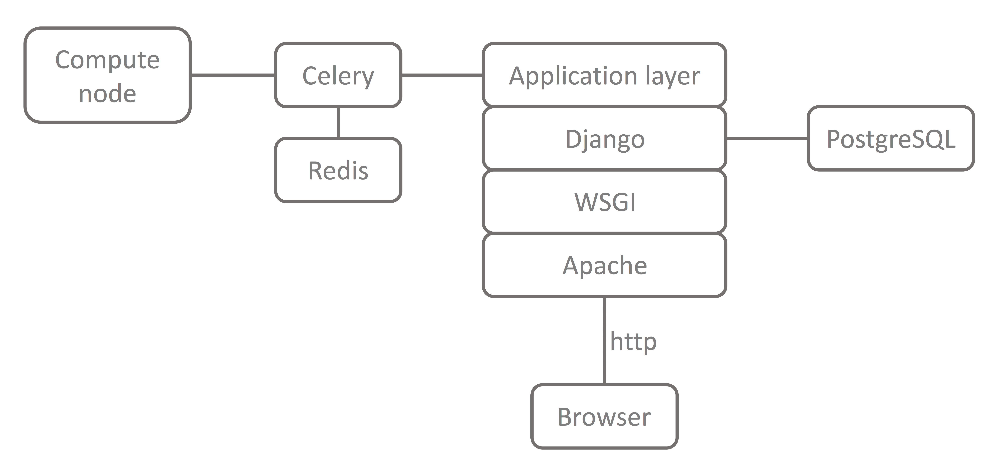

[](https://travis-ci.org/neutrons/web_reflectivity)
[](https://doi.org/10.5281/zenodo.596150)
[](https://codecov.io/gh/neutrons/web_reflectivity)
[](https://web-reflectivity.readthedocs.io/en/latest/?badge=latest)

# Web Interface for Reflectivity Fitting
This application provides a user interface to generate a [REFL1D](https://github.com/reflectometry/refl1d) script and run it on a remote node.

Documentation is available at [https://web-reflectivity.readthedocs.io/](https://web-reflectivity.readthedocs.io/).

## Introduction
This application provides a web interface to perform modeling of reflectivity data. This Django application gives users forms to set up their model and submit fitting jobs. To do so, it generates a python script to be executed either locally or on a remote compute resource. The generated script launches [REFL1D](https://github.com/reflectometry/refl1d), which does the actual minimization.

Job management is done using a Django [remote submission package](https://github.com/ornl-ndav/django-remote-submission/). It manages remote jobs using the [Celery](http://www.celeryproject.org/) 
distributed task queue and provides real-time monitoring of remote
jobs and their associated logs. Celery uses message brokers to pass messages between the Django
application and compute nodes. The [Redis](https://redis.io/) in-memory data structure store is used as
the message broker. The script executed on the compute node sets up and executes the REFL1D fit,
then gathers the output data.



## Prerequisite
Requirements for the application can be found in `requirements.txt`, which can be installed using 

```bash
make deps
```

You will also need to install [redis-server](https://redis.io/).

## Test installation
The information below describes how one would deploy the application in production. For a simpler test deployment,
see the instructions to [run a test server](test/README.md).

## Configuration and installation

### Database installation
The Django application will need a database. It was developed using PostgreSQL, but can be used with any database.
You can enter your database details in the `web_reflectivity/web_reflectivity/settings.py` file.

### Authentication
The application supports both users local to the application or users authenticated through LDAP.
To use LDAP, the authentication settings should be entered in `web_reflectivity/web_reflectivity/settings.py`.
For that purpose, `openssl` should be installed.

Once a user is logged in, the application will submit jobs to your compute resources on the user's behalf, through celery.
An ssh key should be generated and placed in the apache user's .ssh directory. It should also be copied in the celery user's .ssh directory.

### Apache configuration
The application was developed using `apache` and `mod_wsgi`, although it could be served by other methods compatible with Django.
An example apache configuration is available in `apache/apache_django_wsgi.conf`. This file can be modified with your SSL details
and put in `/etc/httpd/cond.d`.

### Redis configuration
Redis can be run with default configuration.

### Celery configuration
On a production system, you will want to run celery as a service.
To do this, copy the `web_reflectivity/web_reflectivity/celeryd` file into `/etc/default/celeryd`

### Install the application
The application installs in `/var/www/web_reflectivity`.
```bash
sudo make install
```

## Starting the application

### Start Redis
```bash
sudo /sbin/service redis start
```

### Start celery
```bash
sudo /sbin/service celeryd start
```

### Start apache
```bash
sudo /sbin/service httpd restart
```


## Citing this software
Please cite the following when using this software:

- P. A. Kienzle, K. V. O'Donovan, J. F. Ankner, N. F. Berk & C. F. Majkrzak, REFL1D.
- M. Doucet, R. M. Ferraz Leal, T. C. Hobson, ORNL Reflectivity Fitting Interface (2017). DOI: 10.5281/zenodo.260178

