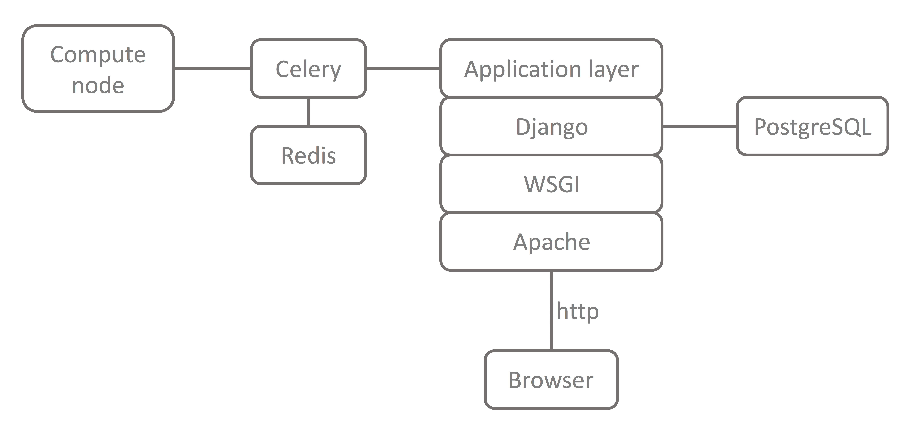

.. web_reflectivity documentation master file, created by
   sphinx-quickstart on Wed Aug 16 13:16:05 2017.
   You can adapt this file completely to your liking, but it should at least
   contain the root `toctree` directive.

User Documentation
==================

This Django application provides a user interface to generate a 
`REFL1D <https://github.com/reflectometry/refl1d>`_ script and run it on a remote node.
This application gives users forms to set up their model and submit fitting jobs.
To do so, it generates a python script to be executed either locally or on a remote compute resource.
The generated script launches, which does the actual minimization.

Job management is done using a Django `remote submission package <https://github.com/ornl-ndav/django-remote-submission/>`_.
It manages remote jobs using the `Celery <http://www.celeryproject.org/>`_ 
distributed task queue and provides real-time monitoring of remote
jobs and their associated logs. Celery uses message brokers to pass messages between the Django
application and compute nodes. The `Redis <https://redis.io/>`_ in-memory data structure store is used as
the message broker. The script executed on the compute node sets up and executes the REFL1D fit,
then gathers the output data.

A description of reflectivity, an overview of the main features, and a real-life example of the use of the application are
described in this :download:`article <../reflectivity_fitting_paper.pdf>`.

Developer Documentation
=======================

.. toctree::
   :maxdepth: 2
   :caption: Developer notes:

   installation
   testing

.. toctree::
   :maxdepth: 2
   :caption: Source documentation:

   modules

Indices and tables
==================

* :ref:`genindex`
* :ref:`modindex`
* :ref:`search`
